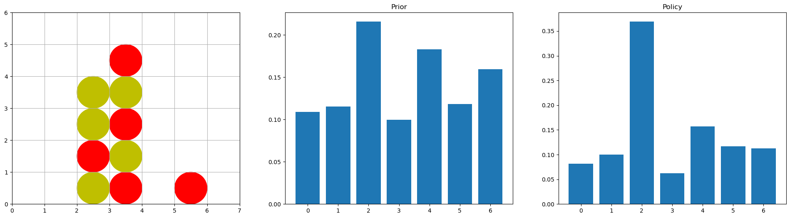
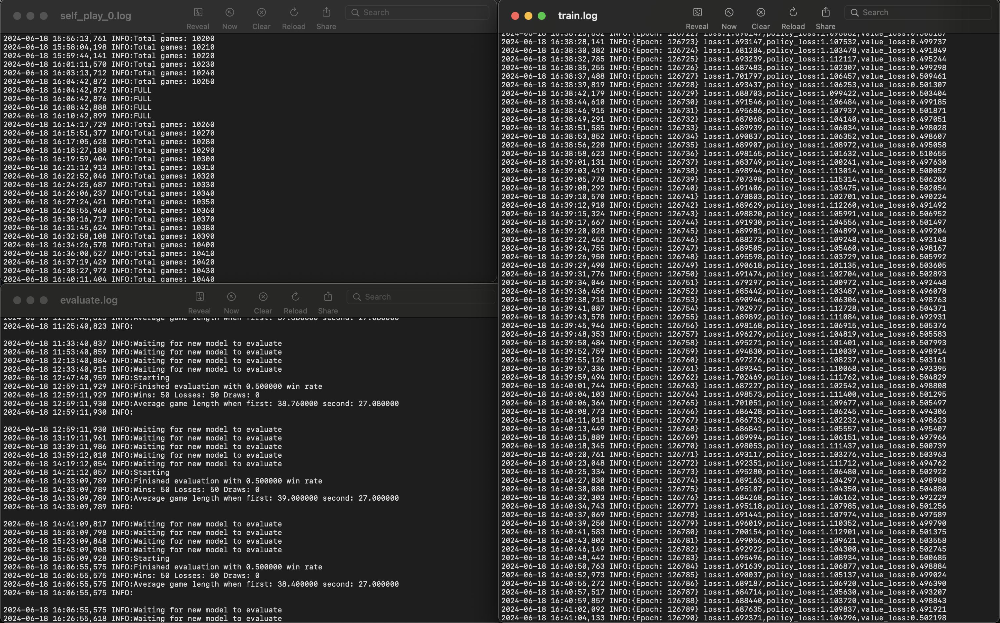
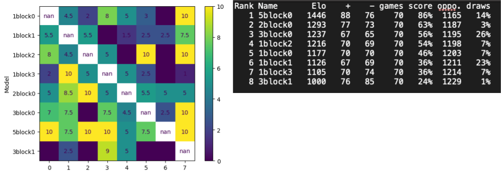

## An implementation of DeepMind's AlphaGo Zero strategy to play Connect 4

Silver, D., Schrittwieser, J., Simonyan, K. et al. [Mastering the game of Go without human knowledge](https://discovery.ucl.ac.uk/id/eprint/10045895/1/agz_unformatted_nature.pdf). Nature 550, 354–359 (2017). https://doi.org/10.1038/nature24270

This project was undertaken with the goal of better understanding the concepts put forth in the above paper by attempting to generalize it to a different game. The result is an AI that learns how to play the board game Connect 4 from scratch, without any prior human knowledge (heuristics, expert moves etc.)

- Python multiprocessing for concurrent training, self-play, and evaluation
- Multithreaded C++ code for computationally intensive Monte Carlo tree search
- Convolutional neural network built with TensorFlow

### Why Connect 4?

Similarly to Go, Connect 4 is a two-player, adversarial, perfect information game. However, it is much simpler; the total board size is 7x6 compared to a full-sized 19x19 Go board, with a maximum of only 7 possible moves in any given state. In addition, all relevant information is encoded in the current board state (the order of previous moves does not matter), unlike Go where removing pieces is possible and repetition of previous states is prohibited (ko rule). This simplicity means Connect 4 was [weakly solved as early as 1988](https://tromp.github.io/c4/connect4_thesis.pdf) using knowledge-based approaches, and [strongly solved in 1995](https://tromp.github.io/c4/c4.html) for legal 8-ply positions. Nevertheless, it is not so simple as to be trivial; there are about [1.6e13 legal positions](https://web.mit.edu/sp.268/www/2010/connectFourSlides.pdf), and a [strong solution for every board state](https://github.com/markus7800/Connect4-Strong-Solver) was only achieved in 2025 and takes ~47 hours and 128 GB RAM. This was a good level of complexity for this project, which ultimately achieved strong play in around a day running on one laptop.

## Installation

```bash
conda env create --file environment.yml
```

This project was written and run on a M1 Macbook. If you are on a different platform, some dependencies may change and you will have to recompile the C++ code found in /cppconnect (not required for demo).

## Demonstration

demo.ipynb is a Jupyter Notebook where you can try playing against a trained model as well as see its calculated move probabilities. A pre-trained model has been included in models/best. Note that the model will be slower than during actual self-play as this notebook does not use the C++ tree search code, instead it is written in Python so that we can easily examine each step of the tree search. 

```bash
jupyter notebook demo.ipynb
```


 
## Training your own model

To begin training from scratch, first ensure models/best/ is empty. Modify hyperparameters found in modules/config.py as desired. Note that hyperparameters related to tree search are found instead in cppconnect/include/Config.h and require recompilation after changing. Then simply run:

```bash
python main.py
```

This will create concurrent training, self-play, and evaluation instances. You can watch the training process by monitoring the logs:



## Optimizing and comparing different hyperparameters

optimize.py will train the model while sampling from a space of multiple hyperparameters in order to find the best combination. It is currently set up to explore the following space:

- w: L2 weight decay, 0.0001 - 0.1
- n: number of layers, 1 - 3
- m: momentum, exp(uniform(-0.5,0))
- f: number of filters, 16 - 256
- l: learning rate, 0.0001 - 0.1
- b: batch size, 64 - 2048

tournament.py will pit any number of trained models against each other in a round-robin tournament. Place each model in models/tournament/ and number them starting from 0. Each pairing will play num_eval_games (set in cppconnect/include/Config.h). The results will be printed out in console, in a format that can be pasted into [BayesElo](https://www.remi-coulom.fr/Bayesian-Elo/) to calculate ratings.



## Possible extensions

- Making the game harder: bigger board size, connect more than 4
- Learning without needing to know the rules of the game: [MuZero](https://en.wikipedia.org/wiki/MuZero)
